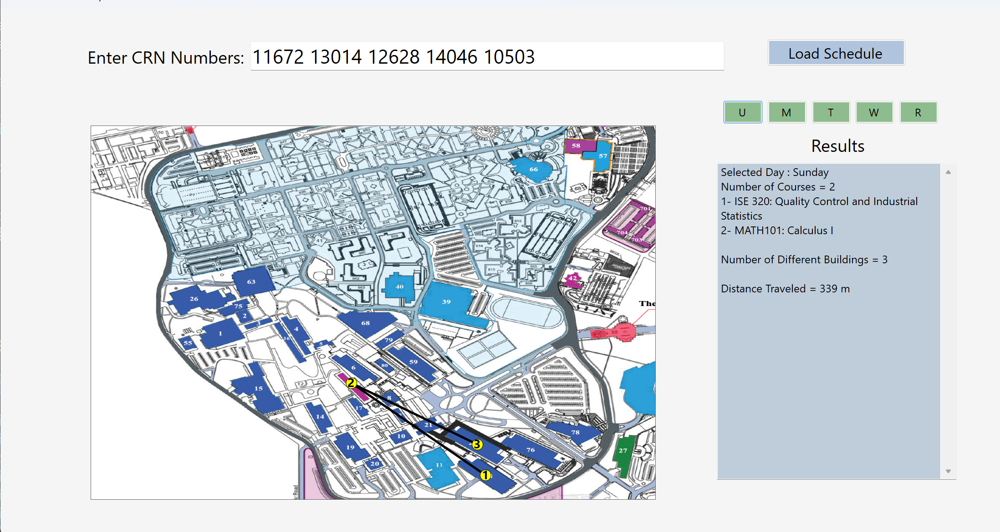

# Course Schedule Tool

Desktop application that allows students to input course CRNs and automatically generate personalized schedules.

## Features

- Generate course schedules using CRN numbers
- Parse course data from Excel files
- Visualize campus routes between classes
- Calculate walking distance between buildings
- Interactive schedule results display

## Technologies

- C#
- .NET
- Windows Forms
- Excel data parsing

## Screenshot

